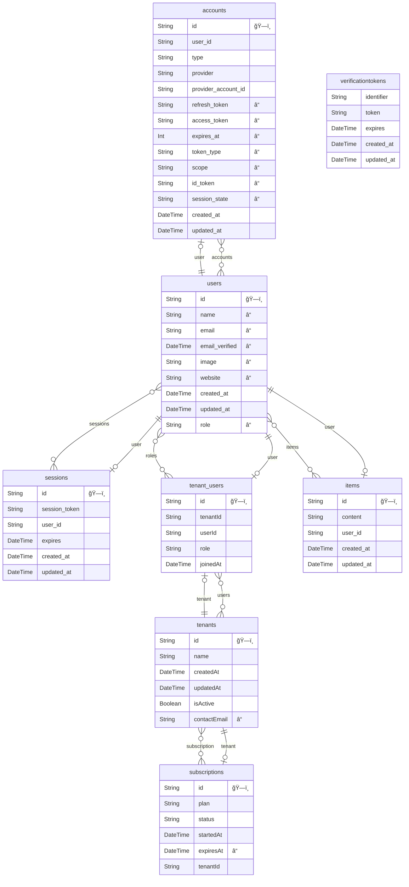

```mermaid
erDiagram

  "accounts" {
    String id "ğŸ—ï¸"
    String user_id
    String type
    String provider
    String provider_account_id
    String refresh_token "â“"
    String access_token "â“"
    Int expires_at "â“"
    String token_type "â“"
    String scope "â“"
    String id_token "â“"
    String session_state "â“"
    DateTime created_at
    DateTime updated_at
    }


  "sessions" {
    String id "ğŸ—ï¸"
    String session_token
    String user_id
    DateTime expires
    DateTime created_at
    DateTime updated_at
    }


  "users" {
    String id "ğŸ—ï¸"
    String name "â“"
    String email "â“"
    DateTime email_verified "â“"
    String image "â“"
    String website "â“"
    DateTime created_at
    DateTime updated_at
    String role "â“"
    }


  "tenants" {
    String id "ğŸ—ï¸"
    String name
    DateTime createdAt
    DateTime updatedAt
    Boolean isActive
    String contactEmail "â“"
    }


  "tenant_users" {
    String id "ğŸ—ï¸"
    String tenantId
    String userId
    String role
    DateTime joinedAt
    }


  "subscriptions" {
    String id "ğŸ—ï¸"
    String plan
    String status
    DateTime startedAt
    DateTime expiresAt "â“"
    String tenantId
    }


  "verificationtokens" {
    String identifier
    String token
    DateTime expires
    DateTime created_at
    DateTime updated_at
    }


  "items" {
    String id "ğŸ—ï¸"
    String content
    String user_id
    DateTime created_at
    DateTime updated_at
    }

    "accounts" o|--|| "users" : "user"
    "sessions" o|--|| "users" : "user"
    "users" o{--}o "accounts" : "accounts"
    "users" o{--}o "sessions" : "sessions"
    "users" o{--}o "items" : "items"
    "users" o{--}o "tenant_users" : "roles"
    "tenants" o{--}o "subscriptions" : "subscription"
    "tenants" o{--}o "tenant_users" : "users"
    "tenant_users" o|--|| "tenants" : "tenant"
    "tenant_users" o|--|| "users" : "user"
    "subscriptions" o|--|| "tenants" : "tenant"
    "items" o|--|| "users" : "user"
```
